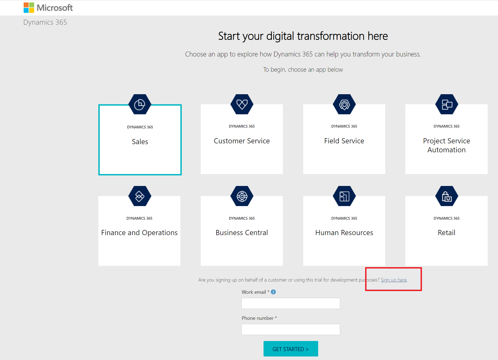

# Overview

This OpenHack enables attendees to build a Power App that leverages the Dynamics 365 Education Accelerator and key parts of the Power Platform, including Power Automate, AI Builder, Power BI, Connectors, Power Virtual Agent, and the Dataverse, while also integrating with Microsoft Teams and Azure. This OpenHack simulates a real-world scenario where Evergreen Elementary School is about halfway through their school year and has long been a leader in implementing new digital initiatives.  As part of their digital transformation journey, Evergreen has implemented the Dynamics 365 Education Accelerator in order to provide their staff with a holistic student profile and facilitate better communication between the school, the students and their families.  In order to further extend their implementation, Evergreen Elementary School’s administration has requested a new round of improvements to their system. 
During the “hacking” attendees will focus on creating a Power App for teachers to better manage students and linking it to the Dataverse, building a custom connector and linking it to Azure Cognitive Services, using AI Builder to build an AI model, creating Power BI queries and visuals to satisfy reporting needs, scripting a chatbot with Power Virtual Agents, creating an integration between Microsoft Teams and the Dynamics 365 Education Accelerator app, and migrating their work across environments to meet ALM best practices.  By the end of the OpenHack, attendees will have built out a technical solution that serves as an all-encompassing solution for the modern teacher in the digital age, built on the building blocks of the Power Platform.

# Technologies

Dynamics 365, Dataverse, Common Data Model, Power Apps, Power Automate, Power BI, Power Virtual Agents, Connectors, AI Builder, Microsoft Teams, and Azure Cognitive Services

# Prerequisites

## Knowledge Prerequisites
To be successful and get the most out of this OpenHack, familiarize yourself with the Power Platform. We encourage everyone to complete the free ‘App in a Day’ Power Apps training course to learn the basics of building canvas and model-driven apps, using CDS to store data, and integrating with Power Automate. Be prepared to roll up your sleeves, learn, and participate in an interactive team environment.

## Tooling Prerequisites

To be successful and get the most out of this OpenHack and to avoid any delays with downloading or installing tooling, you are encouraged to have the following ready to go and to review the links and resources listed (as needed for upskilling).
- [Power BI Desktop](https://powerbi.microsoft.com/en-us/desktop/)

**Development Environment Configuration**

 - None
 
**Language-Specific Prerequisites**

- None  
    
**Post Learning Recommendations**
- [Microsoft Learn – Dynamics 365](https://docs.microsoft.com/en-us/learn/dynamics365/)
- [Microsoft Learn – Power Platform](https://docs.microsoft.com/en-us/learn/powerplatform/)

# Environment Setup

There are three available options for obtaining an environment to
complete the Dynamics 365 + Power Platform OpenHack: 
1. Provide attendees a pre-configured environment  
2. Advise attendees on [how to spin up a 30-day
trial environment](#option-2-30-day-trial-environment)
3. Have them bring their own subscription (BYOS).

This document will focus on the latter two.

## Bill of Materials

The following are required in order to successfully complete the
Dynamics 365 + Power Platform OpenHack:
-   Subscriptions (Trials subscriptions will work)
    -   M365 E3 subscription (*non-Microsoft tenant recommended*)
    -   Power BI Pro subscription
    -   AI Builder subscription
-   Solutions
    -   Dynamics 365 Education Accelerator ([installed via AppSource](https://appsource.microsoft.com/en-us/product/dynamics-365/mshied.educationcommondatamodel?tab=Overview))
    -   [PowerPlatformOpenHacks.zip (Managed Solution)](deploy/PowerPlatformOpenHackThings.zip?raw=true)
-   Applications
    -   Power BI Desktop

## Option 2: 30-day Trial Environment

### How to set up a Dynamics 365 Trial and create your Power Platform tenant

1.  Open a web browser and navigate to [trials.dynamics.com](https://trials.dynamics.com/) and click
    "Sign up here".

    > Note: *If you are already logged in with another Microsoft 365 account, you
    may need to open an incognito browser.*

    

1.  You will get a pop-up asking you if you are a partner or Microsoft
    employee. Always try to be honest, but in this case we're going to
    click "no and continue signing up" so that we can see the full
    experience.

    

1.  Enter your email address, then provide the necessary information
    required. You must provide a phone number where you can either be
    texted or called with a verification code to prove that you are not
    a robot.

    

1.  Once the code is verified, you will be able to create your new
    domain, which will be the unique name used to identify your Dynamics
    365 tenant. Finish creating your business identity user and sign up.

    

1.  You will then be able to navigate to your newly created tenant.

    

1.  Select at least one first party app to get started with (you can
    select more later if you wish). This will complete your setup.

    *\*You could also select none if none of these apps meet your business needs.*

    

1.  You will then be navigated to your newly created tenant. From here,
    you can open the menu in the upper left-hand corner to navigate to
    the Admin center to continue your setup.

    

### Installing Dynamics 365 Education Accelerator
1. Install the [Dynamics 365 Education Accelerator from AppSource](https://appsource.microsoft.com/en-us/product/dynamics-365/mshied.educationcommondatamodel?tab=Overview) into the tenant and environment you created in the previous section. 
    > Note: The Dynamics 365 Education Accelerator may take up to an hour to install.  It also comes with sample data that may not install on the first try.

## Option 3: Bring You Own Subscription 

If you decide to bring your own subscription, you will need two
environments (one for Dev, one for "Prod") to complete the OpenHack
challenges. You will need the following Bill of Materials installed in
each environment:

-   Solutions

    -   Dynamics 365 Education Accelerator ([installed via AppSource](https://appsource.microsoft.com/en-us/product/dynamics-365/mshied.educationcommondatamodel?tab=Overview))

-   Subscriptions (Trials subscriptions will work)

    -   Office 365 E3 subscription or E5 for Power BI Pro to be included

    -   Power BI Pro subscription

    -   AI Builder subscription

-   Applications

    -   Power BI Desktop
